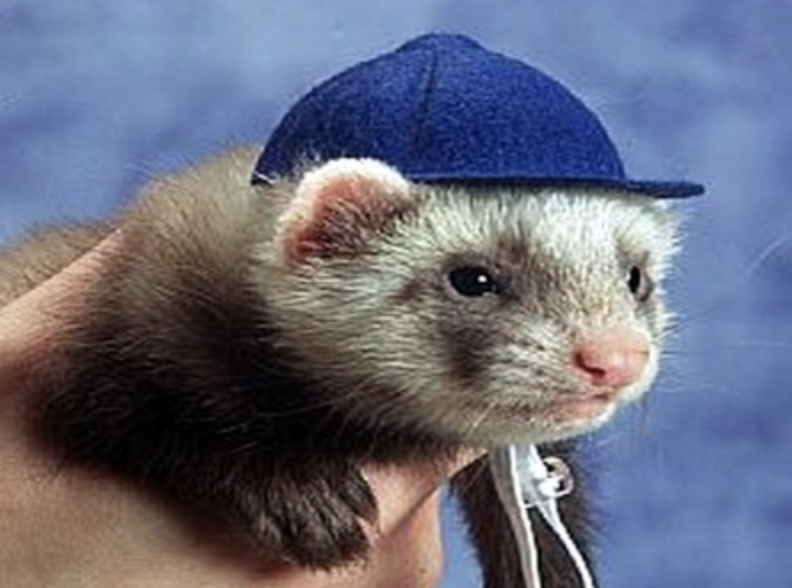
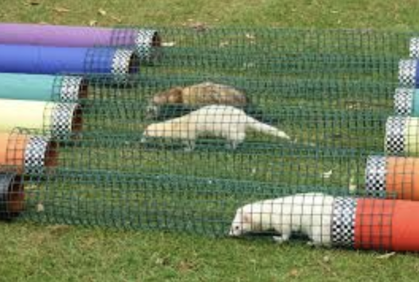

# Ferret Racing

It's the moooooost wonderful time of the year! FERRET RACING SEASON.

Charities rescue sad little ferrets and find them loving homes. In order to fundraise, these delightful furry worms are occasionally 'raced' at village fairs. (No ferrets were harmed in the making of this Rails app). Whatever their final position, they win a treat. It's up to you to make the awesome website for this!

## Objectives
+ MVC
+ REST
+ Request/Response Cycle
+ Form/Form Helpers
+ ActiveRecord
+ Validations

## Setup

Before you begin, fork and clone this repo, run `bundle install` and `rake db:migrate` to get started.

## The Domain

A few things have been set up for you already. Take a minute to get acquainted with what currently exists in the files.

We need a way to keep track of all the ferrets, the charity they belong to, and their races (which take place in special tunnels).

Reminder:
- A charity can have a lot of ferrets, but a ferret can only belong to one charity.
- A ferret can have a lot of tunnels through different races.
- No two ferrets can have the same name. They are special and unique creatures! However, there's a law that all ferret names must be more than six characters.

The charity/ferret relationship, model and migration has already been set up for you. You need to do the rest of what has been asked of you below. DO NOT just do everything you can think of! Read the instructions!

## Instructions
Complete the following:
- any missing migrations to update the schema
- set up the relationships between models
- add validations
- seed the database using the templates provided (add more data)
- create routes, controllers and views according to the deliverables

## Deliverables

Read through to get a sense of the scope of this code challenge, and then tackle them one by one.

1. I should be able to see a list of all ferrets, and click through to see an individual ferret's page

2. The ferret show page should include the ferret's name, whether they are neutered, and the charity they belong to

3. I should be able to edit a ferret (whoops! Turns out SassyPaws wasn't neutered and now we have lots of little SassyPaws)

4. I should be able to create a new ferret, with validated name, toggle whether they are neutered, and select only one charity that they belong to

5. I should be able to view all tunnels, and click through to see an individual tunnel's page

6. On a tunnel's page, I should be able to see all the ferrets who have raced in that tunnel

BONUS:
Make sure you have good user flow by having links like "Go Back!" or "See all Ferrets!" to avoid navigating solely through the address bar.
